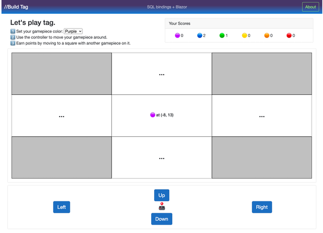

# Tag App: Azure SQL + Blazor WebAssembly + Azure Functions SQL bindings Sample


Demo environment available at https://aka.ms/buildtag



## Contents

| File/folder | Description |
|-------------|-------------|
|[APIs](./APIs/)|Azure Functions project folder, backend APIs.|
|[BlazorWASM](./BlazorWASM/)|Blazor WebAssembly project folder, frontend web UI.|
|[SqlDB](./SqlDB/)|SQL project folder, data storage.|


## Getting Started

### Prerequisites
- VS Code
- Docker
- .NET SDK 6.0.408 or newer
- Azure Functions Core Tools
- Static Web Apps CLI

### Deploy a local SQL instance

The SQL database objects are defined in the SQL project folder and can be deployed to a local development environment using the SQL Database Projects extension in VS Code or Azure Data Studio. More information on publishing a SQL project to a container for local development is available in the [SQL Database Projects documentation](https://learn.microsoft.com/sql/azure-data-studio/extensions/sql-database-project-extension-build?view=sql-server-ver16#publish-the-sql-project-and-deploy-to-a-local-container).

### Run sample locally

Copy the `local.settings.sample.json` file to `local.settings.json` and update the connection string to point to your local SQL instance.


Across 3 terminals:

1. in **APIs** folder, start the Azure Functions local runtime to serve the APIs:
```bash
func start
```

2. in **BlazorWASM** folder, start the Blazor WebAssembly app:

Note: The `DOTNET_WATCH_SUPPRESS_LAUNCH_BROWSER` is used to disable dotnet from automatically opening a window after watch completes. We'll be running `swa` to host the content in the next step so the extra browser window is unnecessary.

```bash
SET DOTNET_WATCH_SUPPRESS_LAUNCH_BROWSER=1
dotnet watch
```

3. in any folder, start the Static Web Apps CLI to serve the static web app and proxy API requests to the Azure Functions local runtime:
```bash
swa start http://localhost:5001 --api-location http://127.0.0.1:7071
```

### Deploy to Azure overview

The following are the steps required to deploy this sample to Azure and enable continuous deployment workflows for all 3 components (APIs, Blazor, and SQL).

1. Create an Azure Functions app and place the publish profile in the GitHub secrets as `AZUREAPPSERVICE_PUBLISHPROFILE`.  This enables the sample workflow [functions-deploy.yml](.github/sample-workflows/functions-deploy.yml) to deploy the Azure Functions. More information: https://learn.microsoft.com/azure/azure-functions/functions-how-to-github-actions?tabs=dotnet

2. Create an Azure SQL Database and place the connection string in the GitHub secrets as `SQLDB`.  This enables the sample workflow [sql-deploy.yml](.github/sample-workflows/sql-deploy.yml) to deploy the database objects. More information: https://learn.microsoft.com/azure/azure-sql/database/single-database-create-quickstart

3. Add an application setting for `SqlConnectionString` to the Azure Functions app with the connection string to the Azure SQL Database.  This enables the Azure Functions to connect to the database. More information: https://docs.microsoft.com/azure/azure-functions/functions-how-to-use-azure-function-app-settings?tabs=portal#settings

4. Create an Azure Static Web App, leaving the `API` location blank and setting it to the `Standard` plan.  Linking the static web app to your repository will create a GitHub Action workflow that will build and deploy the static web app, similar to [static-web-apps-deploy.yml](.github/sample-workflows/static-web-apps-deploy.yml).  More information: https://learn.microsoft.com/azure/static-web-apps/functions-bring-your-own

5. If you did not link the Azure Static Web App to the Azure Functions app during creation, link the Azure Functions to the Azure Static Web App.  More information: https://learn.microsoft.com/static-web-apps/functions-bring-your-own#link-an-existing-azure-functions-app

## API Summary

### GET board state
[APIs/GetBoardState.cs](APIs/GetBoardState.cs)
- sends X and Y coordinates in query string
- returns gamepieces in the 4 nearest squares

SQL bindings:
- Stored procedure SQL input binding with parameters from request query string values

### GET user scoreboard
[APIs/GetUserScoreboard.cs](APIs/GetUserScoreboard.cs)
- sends userid in query string
- returns scores for a user

SQL bindings:
- Query text SQL input binding with parameter from request query string value

### GET user info
[APIs/GetUserInfo.cs](APIs/GetUserInfo.cs)
- sends userid and passkey in request header
- returns current user info

SQL bindings:
- Imperative binding for a stored procedure SQL input binding with parameters from request header values

### PATCH player gamepiece color
[APIs/PlayerColor.cs](APIs/PlayerColor.cs)
- sends userid and passkey in request header, userinfo (including color) in request body
- returns updated userinfo

SQL bindings:
- Imperative binding for a stored procedure SQL input binding with parameters from request header values
- Table output binding with content from request body


### PUT new user info
[APIs/NewUser.cs](APIs/NewUser.cs)
- sends new user passkey in request body
- returns new saved user info

SQL bindings:
- Stored procedure SQL input binding with no parameters
- Table output binding with passkey from request body and output from stored procedure


## Frontend/Backend interactions

1. first load of the page
    - setup a user
        - get a new userid from server, request with a new password (both guids)
        - store the userid and password in local storage
        - user sets name and selects from 6 colors for token
        - update user info on server with name and token color
        - place user at 0,0 on board
2. every load of the page
    - get user position on the board
    - get the overall board state
        - nearest 4 tiles
3. whenever a user moves
    - send move to server
    - get move result
    - update user position on board
    - update board state
    - update user info/scoreboard

## Data storage
1. user
    - userid
    - password
    - name
    - token color
    - x
    - y
2. scoreboard
    - userid
    - count per color
3. user moves
    - userid
    - move number
    - move direction
    - move result
    - move time

## Resources

(Any additional resources or related projects)

- Azure SQL bindings for Azure Functions: https://aka.ms/sqlbindings
- SQL Database Projects for VS Code and Azure Data Studio: https://aka.ms/azuredatastudio-sqlprojects